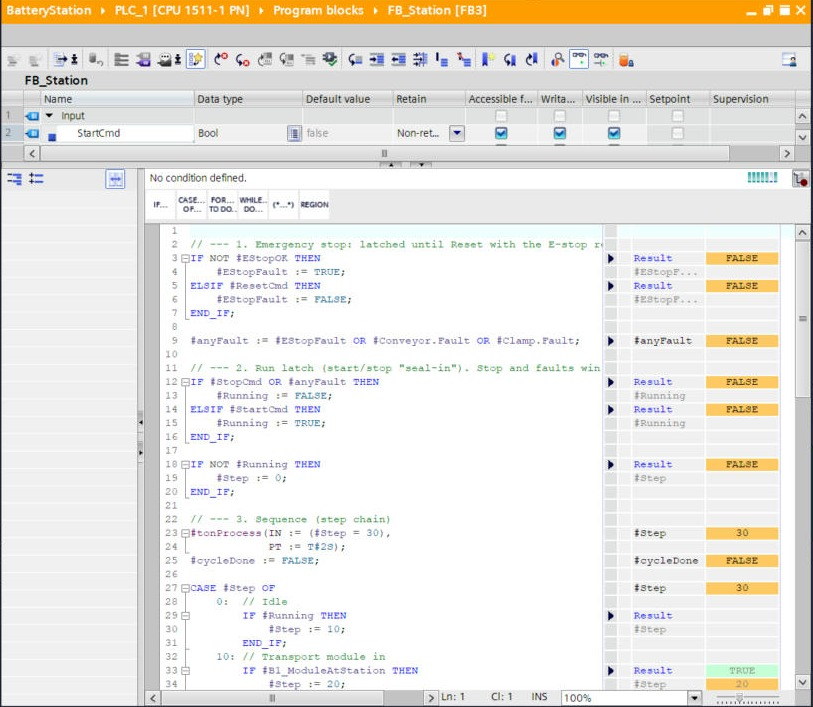
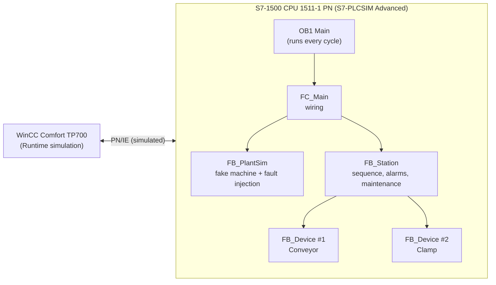
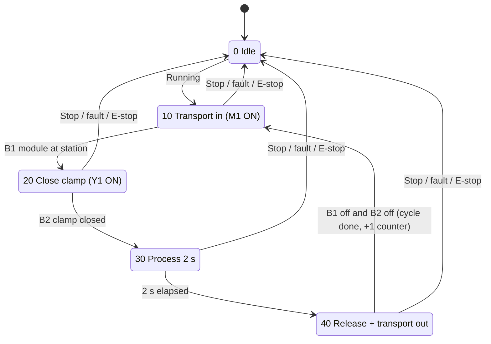

# Battery Module Assembly Station – Siemens S7-1500 PLC + WinCC HMI (simulated)

A small but complete automation project built in **Siemens TIA Portal V20**: a simulated battery-module assembly station with a step sequence, start/stop and emergency-stop logic, timeout fault detection, cycle-time measurement and a **preventive-maintenance counter**. It's tested end to end in **S7-PLCSIM Advanced** and operated from a **WinCC Comfort touch panel** (simulated).

Everything runs on one Windows PC with **free Siemens trial licences**, so you don't need any hardware. This repo is written so that **anyone can rebuild it step by step**, including the problems I hit and how I fixed them.

> **Honest scope:** this is a **simulated learning/portfolio project**, not a machine that has run in a factory. The emergency stop here is **standard (non-safety) logic** for demonstration only. A real E-stop must be a hard-wired safety circuit or an F-CPU safety program designed to ISO 13849 / IEC 62061.

---

## What the station does

1. **Conveyor (M1)** brings a battery module in, until sensor **B1** sees it at the station.
2. **Clamp (Y1)** closes, until sensor **B2** confirms it's closed.
3. **Process** runs for 2 s (standing in for pressing or screwing).
4. **Clamp opens** and the conveyor carries the module out.
5. Repeat until **Stop**.

| Feature | How it works |
|---|---|
| Start / Stop | Seal-in ("run latch"). Stop and any fault always win over Start. |
| Emergency stop | Stops everything instantly. **Latched:** releasing the E-stop does **not** restart the machine; an operator must press Reset, then Start. |
| Fault detection | One reusable block, `FB_Device`, watches each device. Output ON but no sensor feedback within the timeout → fault (conveyor 8 s = jam, clamp 3 s = sensor fault). |
| Maintenance | +1 per finished cycle. At 20 cycles the yellow lamp and a warning show. **Service done** resets the count. Each device also counts its starts and running seconds. |
| Cycle time | Measured every cycle (≈ 7.3 s = 3 + 0.8 + 2 + 1.5 s). |
| Testing without hardware | `FB_PlantSim` fakes the machine, and two switches **inject faults on purpose** (jam, broken clamp sensor). |

---

## Screenshots

| | |
|---|---|
|  **Conveyor jam:** no module after 8 s → red FAULT lamp, machine stops, alarm logged. |  **Clamp sensor fault:** no "closed" signal after 3 s → fault. |
|  **E-stop pressed:** everything stops immediately. |  **E-stop released:** the machine **stays stopped** until Reset + Start. |
|  **SCL code monitored live** in TIA Portal. |  **Watch table:** all signals live (Step 10, conveyor ON, AlarmWord 16#0008 = maintenance due). |

More: [OB1 + program blocks](images/tia-ob1-and-program-blocks.jpg) · [PLC tags](images/tia-plc-tags.jpg) · [Network view](images/tia-network-view.jpg) · [HMI screen editor](images/tia-hmi-screen-editor.jpg) · [HMI alarms](images/tia-hmi-discrete-alarms.jpg) · [PLCSIM Advanced](images/plcsim-advanced-control-panel.jpg)

---

## Architecture

Step chain (`Station_DB.Step`):

Full explanation: **[docs/program-design.md](docs/program-design.md)**

---

## Repository contents

| Path | What it is |
|---|---|
| [`src/BatteryStation.scl`](src/BatteryStation.scl) | The whole PLC program as one SCL source file (import it with *External source files → Generate blocks from source*). |
| [`tia/BatteryStation.zap20`](tia/) | Archived TIA Portal V20 project (PLC + HMI + watch table). Open it with *Project → Retrieve*. |
| [`docs/getting-started.md`](docs/getting-started.md) | **Rebuild everything from zero**, click by click. |
| [`docs/program-design.md`](docs/program-design.md) | How the program works: blocks, I/O, sequence, timers, counters. |
| [`docs/hmi.md`](docs/hmi.md) | How the HMI screen and alarms are built. |
| [`docs/test-report.md`](docs/test-report.md) | The 5 tests, expected vs actual results, with screenshots. |
| [`docs/troubleshooting.md`](docs/troubleshooting.md) | Problems I hit while building it (and fixes) + an operator alarm guide. |
| [`docs/maintenance-plan.md`](docs/maintenance-plan.md) | Example preventive-maintenance plan using the counters the program collects. |
| `images/` | Screenshots used in the docs. |

---

## Quick start (if you already have TIA Portal V20)

1. Start **S7-PLCSIM Advanced** → Online Access **PLCSIM** → instance name `BatteryPLC`, family S7-1500 → **Start**.
2. In TIA Portal: **Project → Retrieve** → `tia/BatteryStation.zap20`.
3. Select **PLC_1** → **Online → Download to device** → interface **PN/IE / PLCSIM** → Start search → Load → *Start module* → Finish.
4. Select **HMI_1** → **Online → Simulation → Start**.
5. On the panel: **START**. Try **SIM: JAM**, **SIM: SENSOR**, **E-STOP**, then **RESET** and **START** again.

New to TIA Portal? Follow **[docs/getting-started.md](docs/getting-started.md)**. It covers downloading the trials and every dialog you'll see.

---

## Tools and versions

| Item | Version used |
|---|---|
| TIA Portal | V20 (STEP 7 Professional + WinCC Advanced, trial licences) |
| PLC | S7-1500 CPU 1511-1 PN (6ES7 511-1AL03-0AB0), programmed in SCL |
| Simulator | S7-PLCSIM Advanced V7.0 (trial) |
| HMI | SIMATIC TP700 Comfort (6AV2 124-0GC01-0AX0), device version 17.0, simulated with WinCC Runtime Advanced |

## Ideas to extend it

- Hardware I/O modules (DI/DQ) mapped to the tags, instead of simulation mode
- An F-CPU safety program for the E-stop (STEP 7 Safety)
- A trend view of cycle time, recipes for different module types
- A ladder (LAD) version of `FB_Device` to compare languages

## Licence

[MIT](LICENSE). Use it, learn from it, adapt it. Siemens, SIMATIC, TIA Portal, WinCC and PLCSIM are trademarks of Siemens AG. This project is not affiliated with Siemens.

**Author:** Basel Haijar, BEng Electrical & Electronic Engineering
