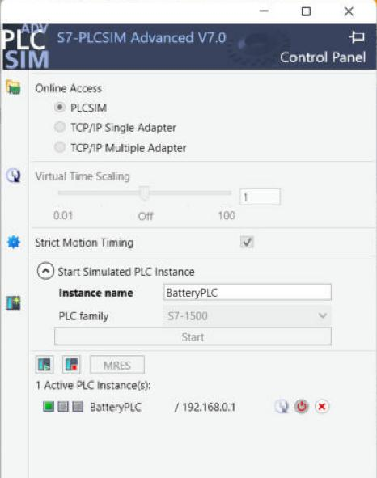

# Getting started: rebuild the project from zero

This guide assumes you have **never used TIA Portal**. It follows exactly what I did, including the dialogs that confused me.

You need: a 64-bit Windows PC with plenty of free disk space (the TIA Portal ISO alone is about 8 GB; check Siemens' system requirements for your version) and a free Siemens account.

> **Two ways to use this repo**
> - **Path A (fast):** open the ready-made project archive `tia/BatteryStation.zap20`. Jump to [step 4](#4-open-the-project).
> - **Path B (learn more):** create the project yourself and import `src/BatteryStation.scl`. Follow every step.

---

## 1. Download the trial software (Siemens)

You need a Siemens account (register on the Siemens Industry Online Support site).

| Software | Siemens Support entry | What you get |
|---|---|---|
| TIA Portal V20: STEP 7 Professional + WinCC trial | Entry ID **109963850** | `TIA_Portal_STEP7_Prof_Safety_WinCC_V20.iso` (~8 GB) |
| S7-PLCSIM Advanced V7.0 trial | Entry ID **109963863** | `SIMATIC_S7-PLCSIM_Advanced_V7.iso` |

Search the entry ID on support.industry.siemens.com.

> ⚠️ **Export-restricted downloads.** Some files (for example the normal *S7-PLCSIM V20* ISO) show a page *"Download of export restricted software"*. That needs a one-time manual approval from Siemens, which can take days. I used **PLCSIM Advanced** instead, which downloaded straight away for me and supports TIA V20 and S7-1500.

## 2. Install

1. **TIA Portal V20:** double-click the ISO (Windows mounts it like a DVD), run `Start.exe`, choose the **Typical** installation, accept the licence terms yourself, restart.
2. **PLCSIM Advanced V7.0:** close TIA Portal first. Mount the ISO, run `Start.exe`, keep the defaults (it also installs **Npcap**, the virtual network driver TIA uses to reach the simulated PLC). Restart if asked.
   - At the end you may see *"License transfer could not be performed because of missing license key medium"*. This is normal: click **Skip license transfer**. You'll use the trial licence instead.

**Trial licences:** the first time each product needs a licence, a window *"Automation License Management – No valid License Key was found"* appears. Select the product (it turns blue) and click **Activate**. I got this for STEP 7 Professional, PLCSIM Advanced and WinCC Advanced. Each trial can only be activated once on a PC.

## 3. Create the project (Path B only)

1. TIA Portal → **Create new project** → name `BatteryStation`.
2. **Add new device** → Controllers → SIMATIC S7-1500 → CPU → **CPU 1511-1 PN** (I used `6ES7 511-1AL03-0AB0`).
3. The **security wizard** appeared when I added the S7-1500 in TIA V20. For a local learning project I chose: confidential-data protection **off**, PG/PC and HMI communication **legacy + secure allowed**, access control **off**. On a real machine, take security seriously.
4. **Project properties → Protection** → tick **"Support simulation during block compilation"**. Without this, the project can't be simulated.
5. **PLC tags → Default tag table** → add the 11 tags in [program-design.md](program-design.md#io-list) (all `Bool`).
6. **External source files → Add new external file** → choose `src/BatteryStation.scl` → right-click it → **Generate blocks from source**. You'll get `FB_Device`, `FB_PlantSim`, `FB_Station`, `FC_Main`, `HMI`, `Station_DB`, `PlantSim_DB`.
7. Open **Main [OB1]** (it's LAD) and **drag `FC_Main`** from the project tree onto Network 1. Now the PLC runs it every cycle.
8. Right-click **PLC_1 → Compile → Hardware and software (only changes)**. Expect **0 errors**. These warnings are normal:
   - *"Inputs or outputs are used that do not exist in the configured hardware"*: there are no I/O modules, because it's a simulation.
   - *"The S7-1500 CPU display does not contain any password protection"*: fine for a simulation.

## 4. Open the project

*Path A:* TIA Portal → **Project → Retrieve** → select `tia/BatteryStation.zap20` → choose an empty target folder.

## 5. Start the simulated PLC (PLCSIM Advanced)

1. Start **S7-PLCSIM Advanced V7.0**. A small **Control Panel** opens; it can also hide in the taskbar tray.
2. **Online Access:** select **PLCSIM** (simplest, no network setup).
3. **Start Simulated PLC Instance:** instance name `BatteryPLC`, PLC family **S7-1500** → **Start**.
4. After 10–30 s the instance appears with a **yellow** light (STOP, empty) and address 192.168.0.1.

## 6. Download the program to the simulated PLC

1. In TIA, click **PLC_1** in the project tree (one click, so it's selected).
2. **Online → Download to device**. The first time you get *Extended download to device*:
   - Type of PG/PC interface: **PN/IE**
   - PG/PC interface: **PLCSIM**
   - Connection: leave the default (*Direct at slot '1 X1'*)
   - **Start search** → the device at 192.168.0.1 appears → select → **Load**
3. **"PLC_1 might not be a trustworthy device"** (self-signed certificate): it's your own simulated PLC, so click **Connect**.
4. **Load preview** → all ✔ → **Load**.
5. **Load results** → action **Start module** → **Finish**.
6. PLCSIM's light turns **green** = RUN. 🎉

> ⚠️ If **Download to device is greyed out**, TIA is probably stuck half-online. Click **Go offline**, then try again. See [troubleshooting](troubleshooting.md).

## 7. Test with the watch table

Open **Watch and force tables → Watch table_1** and click the 👓 **Monitor all** icon. The title bar turns orange, which means you're online.

To "press" a button: type `TRUE` in **Modify value** → right-click → **Modify → Modify now**. Then set `FALSE` and **Modify now** again to release it. Leaving a button at TRUE is like taping it down.

Run the 5 tests in [test-report.md](test-report.md).

## 8. Run the HMI

1. Select **HMI_1** → **Online → Simulation → Start**. It compiles, then the *SIMATIC WinCC Runtime Advanced* window opens.
2. You may get a notice *"Too many tags (PowerTags) have been configured … 128 PowerTags"*. Click **Noted**. This project uses only 13 PowerTags. As far as I can tell it's a licence notice from the PC runtime simulator, and it didn't stop anything.
3. Press **START**. The green lamp lights and Step counts 10 → 20 → 30 → 40.
4. Alarm pop-ups (*Unacknowledged alarms*): select the alarm → **acknowledge button** (bottom right) → close. The ⚠ indicator at the top right toggles the *Pending alarms* window.

How the screen was built: [hmi.md](hmi.md).
