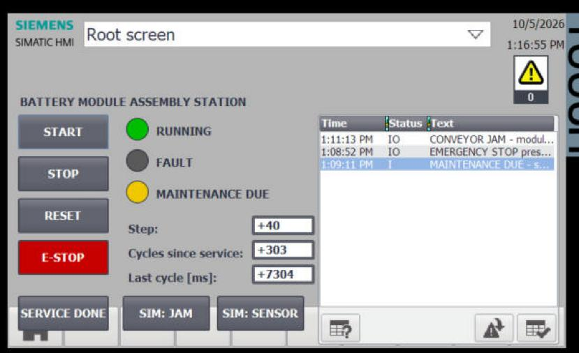
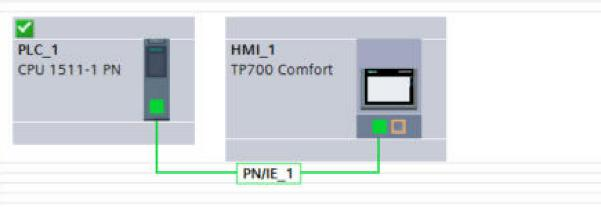
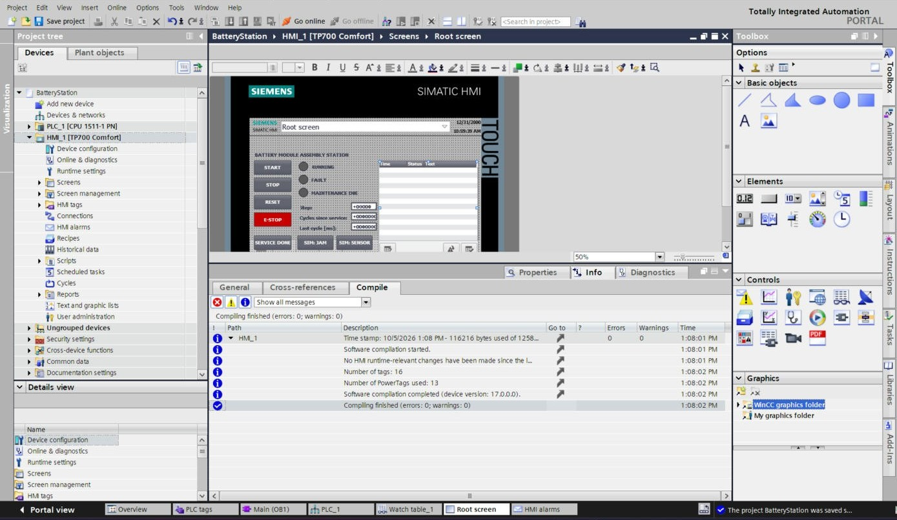
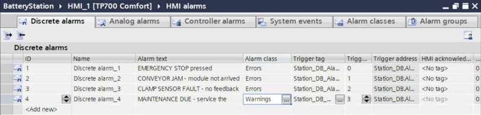
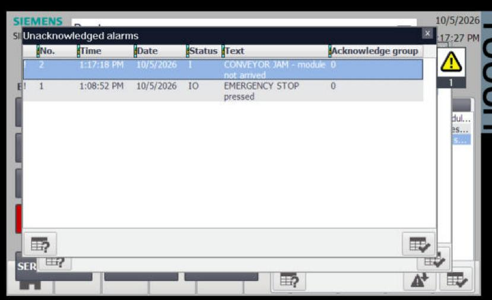

# HMI: WinCC Comfort TP700 (simulated)

## Device and connection

- **Add new device → HMI → SIMATIC Comfort Panel → 7" Display → TP700 Comfort** (`6AV2 124-0GC01-0AX0`, version 17.0).
- In the **HMI Device Wizard**, *PLC connections* → **Browse → PLC_1** (driver *SIMATIC S7 1500*, interface *Ethernet*) → **Finish**. The wizard creates the connection and a root screen with a standard header and footer.

## Screen objects

| Object | Type | Configuration | Why |
|---|---|---|---|
| START, STOP, RESET, SERVICE DONE | Button | Events: **Press → SetBit**, **Release → ResetBit** on `HMI.StartBtn` etc. | Behaves like a real *momentary* push button: ON only while pressed. |
| E-STOP (red), SIM: JAM, SIM: SENSOR | Button | Event: **Click → InvertBit** on `HMI.EStopBtn` / `SimJam` / `SimSensorFault` | Behaves like a *latching* switch: one click ON, the next OFF. |
| RUNNING / FAULT / MAINTENANCE DUE lamps | Circle | Animation **Appearance**, tag `H1_Running` / `H2_Fault` / `H3_MaintenanceDue`, range 0 → grey, 1 → green / red / yellow | A lamp is just a shape whose colour follows a Bool. |
| Step, Cycles since service, Last cycle [ms] | I/O field | Mode **Output**, tags `Station_DB.Step`, `.CyclesSinceService`, `.LastCycleTime` | Display only, so the operator can't type into them. |
| Alarm list | Alarm view | Columns Time, Status, Text | Shows the discrete alarms below. |

Tip: when a button needs a PLC tag for the first time, click **"…"** in the tag field and browse to `PLC_1 → Program blocks → HMI [DB1]`. TIA creates the HMI tag (`HMI_StartBtn`) and its connection automatically.

## Alarms

**HMI alarms → Discrete alarms**, trigger tag `Station_DB.AlarmWord`:

| ID | Text | Class | Trigger bit |
|---|---|---|---|
| 1 | EMERGENCY STOP pressed | Errors | 0 |
| 2 | CONVEYOR JAM – module not arrived | Errors | 1 |
| 3 | CLAMP SENSOR FAULT – no feedback | Errors | 2 |
| 4 | MAINTENANCE DUE – service the station | Warnings | 3 |

- **Errors** must be **acknowledged** by the operator. *Warnings* don't need to be.
- Alarm status codes in the list: **I** = came (incoming), **O** = went (outgoing), **A** = acknowledged. For example `IA` = active and acknowledged, `IO` = came and went.
- I checked the trigger-bit numbering by testing: bit 0 (value 1) shows "EMERGENCY STOP", and bit 3 (value 8) shows "MAINTENANCE DUE".

## Run it

Select **HMI_1 → Online → Simulation → Start**. The PLC must already be running in PLCSIM Advanced (see [getting-started.md](getting-started.md#5-start-the-simulated-plc-plcsim-advanced)).
