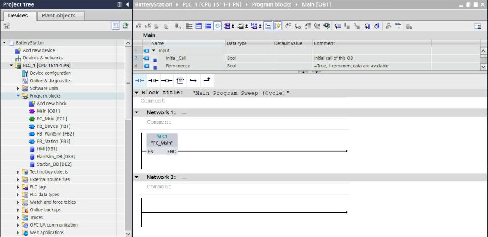
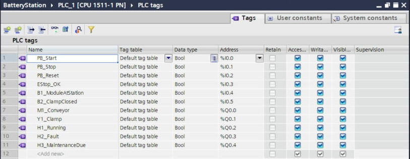

# Program design

The whole program is in one SCL source file: [`src/BatteryStation.scl`](../src/BatteryStation.scl). It's commented line by line.

## 1. The big picture

A PLC is like a worker reading one checklist (**OB1**) from top to bottom, again and again, every few milliseconds. Each pass is a **scan cycle**: read inputs → run the program → write outputs.

```
OB1  Main (runs automatically, every cycle)
 └─ FC_Main            wiring: picks real or simulated sensors, calls the blocks
     ├─ FB_Station     the brain: run latch, step sequence, alarms, maintenance
     │    ├─ FB_Device  instance "Conveyor"  (timeout 8 s)
     │    └─ FB_Device  instance "Clamp"     (timeout 3 s)
     └─ FB_PlantSim    fake machine: turns outputs into sensor signals, fault injection
```



| Block | Type | Why this type |
|---|---|---|
| `Main` | OB1 | The operating system calls it every cycle. |
| `FC_Main` | FC (function) | Only wiring, nothing to remember → no memory needed. |
| `FB_Station`, `FB_Device`, `FB_PlantSim` | FB (function block) | They must **remember** things between cycles (step, timers, counters), so each gets an **instance data block**. |
| `Station_DB`, `PlantSim_DB` | Instance DBs | The FBs' memory. |
| `HMI` | Global DB | Everything the operator panel writes (buttons, fault-injection switches). |

## 2. I/O list

All tags are `Bool` (on/off). The letter codes follow common electrical-drawing practice: PB push button, B sensor, M motor, Y valve, H lamp.

| Tag | Address | Meaning |
|---|---|---|
| `PB_Start` | %I0.0 | Start push button |
| `PB_Stop` | %I0.1 | Stop push button |
| `PB_Reset` | %I0.2 | Reset push button |
| `EStop_OK` | %I0.3 | **TRUE = E-stop NOT pressed** (NC contact: a pressed button *or a broken wire* gives FALSE → machine stops) |
| `B1_ModuleAtStation` | %I0.4 | Sensor: module at station |
| `B2_ClampClosed` | %I0.5 | Sensor: clamp closed |
| `M1_Conveyor` | %Q0.0 | Conveyor motor |
| `Y1_Clamp` | %Q0.1 | Clamp valve |
| `H1_Running` | %Q0.2 | Lamp: running (green) |
| `H2_Fault` | %Q0.3 | Lamp: fault (red) |
| `H3_MaintenanceDue` | %Q0.4 | Lamp: maintenance due (yellow) |



**Simulation mode.** `"HMI".SimMode` is TRUE by default. `FC_Main` then takes B1/B2 from `FB_PlantSim` and the E-stop from the HMI, instead of the real inputs. With hardware you would set SimMode to FALSE.

## 3. FB_Device: one standard block, used twice

Any device that is switched ON and must confirm with a sensor (motor, valve, clamp…) behaves the same way, so it's written **once** and used for both the conveyor and the clamp. This is the key idea of reusable, standardised code.

| Input | Meaning |
|---|---|
| `Cmd` | The sequence wants the device ON |
| `Feedback` | The sensor confirms the device did its job |
| `Timeout` | Maximum time allowed to get feedback |
| `Enable` | FALSE = interlock (e.g. E-stop) |
| `ResetCmd` | Clears the fault |

What it does every cycle:
1. `Q := Cmd AND Enable AND NOT Fault`: output only when allowed.
2. Counts **starts** (rising edge of Q) → `Operations`.
3. **Timeout supervision:** a TON timer runs while `Q AND NOT Feedback`. If it reaches `Timeout`, then `Fault := TRUE` (latched until Reset).
4. Counts **running seconds** → `OperatingTime_s`, using a 1 s self-resetting timer.

`Operations` and `OperatingTime_s` are real maintenance data (see [maintenance-plan.md](maintenance-plan.md)).

## 4. FB_Station: the station logic

**1. E-stop latch.** `EStopOK = FALSE` → `EStopFault := TRUE`. It clears only on **Reset while the E-stop is released**. So releasing the button alone never restarts anything.

**2. Run latch (seal-in).** Stop **or** any fault → `Running := FALSE` (checked **first**, so it wins). Otherwise Start → `Running := TRUE`. Not running → `Step := 0`.

**3. Step chain** (`CASE #Step OF`):

| Step | Action | Moves on when |
|---|---|---|
| 0 Idle | – | Running |
| 10 Transport in | Conveyor ON | B1 sees the module |
| 20 Close clamp | Clamp ON | B2 confirms closed |
| 30 Process | Clamp stays ON, 2 s timer | 2 s elapsed |
| 40 Release + out | Clamp OFF; conveyor ON once clamp is open | B1 and B2 both OFF → **cycle done** → back to 10 |

**4. Devices.** Conveyor and Clamp instances of `FB_Device` get their command from the step, `Enable := NOT EStopFault`, with timeouts of 8 s and 3 s.

**5. Cycle time and counters.** A TON runs while the sequence is active. On *cycle done*: `LastCycleTime := elapsed`, `CyclesTotal +1`, `CyclesSinceService +1`.

**6. Preventive maintenance.** `H3_MaintenanceDue := CyclesSinceService >= ServiceInterval` (20, a demo value). *Service done* sets the counter to 0.

**7. Outputs and AlarmWord.** Lamps and outputs are written. All alarms are packed into one `Word`:

| Bit | Value | Alarm |
|---|---|---|
| 0 | 1 | Emergency stop |
| 1 | 2 | Conveyor timeout (jam) |
| 2 | 4 | Clamp timeout (sensor fault) |
| 3 | 8 | Maintenance due |

The values add up: `16#000A` = 2 + 8 = jam **and** maintenance due. The HMI turns each bit into an alarm message.


*TIA Portal can show the SCL code live: the right-hand column shows the current values (here Step = 30).*

## 5. FB_PlantSim: a fake machine

With no hardware, something has to produce the sensor signals:
- While the conveyor runs, the module "arrives" after **3 s** (B1 ON), and "leaves" **1.5 s** after the conveyor restarts with the clamp open.
- The clamp "closes" **0.8 s** after Y1 turns ON (B2 ON).
- **`SimJam`** stops the module from ever arriving → tests the 8 s conveyor timeout.
- **`SimSensorFault`** stops B2 from ever coming → tests the 3 s clamp timeout.

Expected cycle time: 3 + 0.8 + 2 + 1.5 ≈ **7.3 s**. Measured: `T#7S_304MS`.

## 6. Why SCL (and not only ladder)?

SCL (Structured Control Language, IEC 61131-3 *Structured Text*) is compact for sequences (`CASE`), counters and maths, and easy to keep in Git as a text file. OB1 is in LAD, so both appear in the project. Many plants prefer LAD for maintenance-friendly logic. A LAD version of `FB_Device` would be a good exercise.
