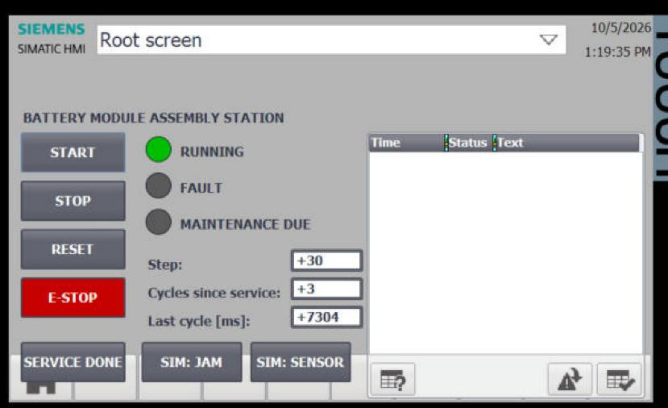
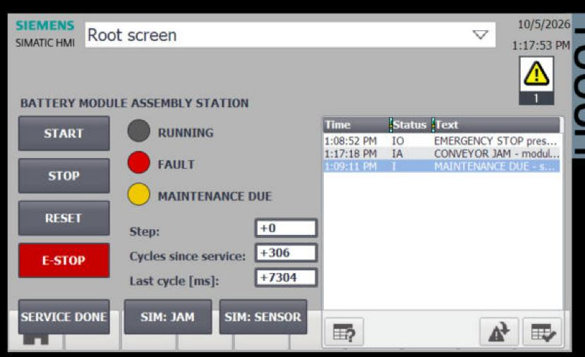
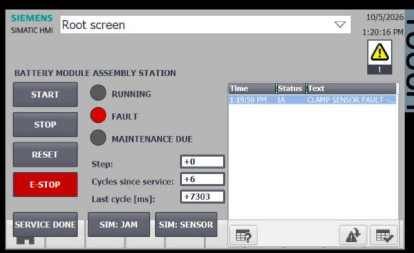
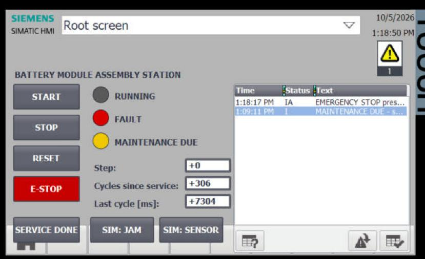
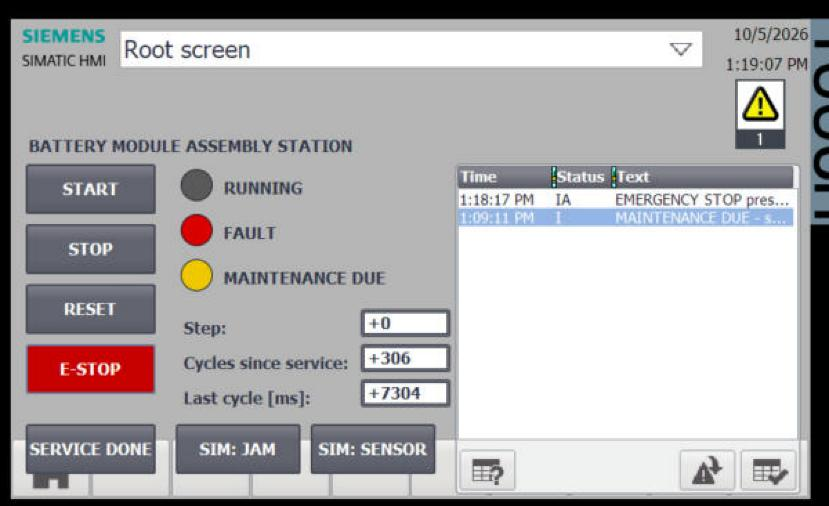
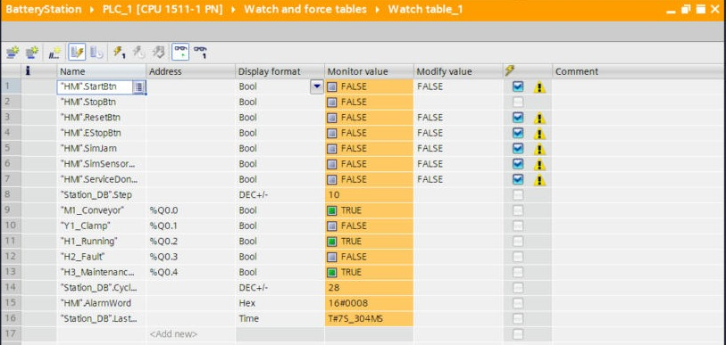

# Test report

**Date:** 5 October 2026 · **Setup:** TIA Portal V20, S7-PLCSIM Advanced V7.0 (instance `BatteryPLC`), WinCC Runtime Advanced simulation of TP700 Comfort · **Method:** watch table first, then repeated from the HMI.

| # | Test | Steps | Expected | Result |
|---|---|---|---|---|
| 1 | Normal run | Press START | Step 10 → 20 → 30 → 40 → 10 …, conveyor and clamp switch in turn, RUNNING lamp ON, cycle time ≈ 7.3 s | ✅ `LastCycleTime = T#7S_304MS` |
| 2 | Conveyor jam | SIM: JAM ON while running | After 8 s at step 10: FAULT lamp, machine stops (Step 0), alarm "CONVEYOR JAM", AlarmWord bit 1 | ✅ |
| 3 | Preventive maintenance | Let it run past 20 cycles, then SERVICE DONE | MAINTENANCE DUE lamp + warning at 20 cycles (AlarmWord 16#0008); counter resets to 0 after Service done | ✅ |
| 4 | Clamp sensor fault | SIM: SENSOR ON | After 3 s at step 20: FAULT lamp, stop, alarm "CLAMP SENSOR FAULT", AlarmWord 16#0004 | ✅ |
| 5 | Emergency stop | E-STOP ON, then OFF | Instant stop of conveyor and clamp, AlarmWord 16#0001. After release the machine **stays stopped** until RESET + START | ✅ |

Recovery after each fault: remove the cause (switch the SIM fault off / release the E-stop) → **RESET** → **START**.

## Evidence

**Test 1: normal run**

**Test 2: conveyor jam**

**Test 4: clamp sensor fault**

**Test 5: E-stop pressed → released (still stopped)**

**Watch table during operation** (Step 10, conveyor ON, maintenance due 16#0008, 7.3 s cycle)

## Not tested (outside a simulation)

- Real I/O wiring, sensor behaviour and timing on hardware
- A safety-rated E-stop circuit (this project uses standard logic only)
- Behaviour after a PLC power cycle (retentive data)
